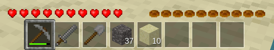

***Hunger NG*** *is a mod for Luanti adding a very customizable and easy to extend hunger system.*

The mod adds a hunger bar at the position of the breath bar and hides the bar if the breath bar becomes visible so the most important bar is shown without cluttering the UI too much.

*Hunger NG* works in singleplayer mode as well as on a multiplayer server. It automatically disables itself when damage is disabled and adapts to the used texture pack. The mod is self-contained and has no dependencies.

## Main difference to most (if not all) hunger mods

All of the hunger-related information is stored as custom player attributes or custom item attributes. There are no global tables polluting the mod namespace or held in the mod’s local chunk. It’s all nice and clean stored in players and items.

Hunger points get subtracted directly from the hunger value instead of being calculated to some sort of exhaustion value that’s being used to reduce the hunger. This gives more detailed control over how many hunger a specific action will cause.

## 3rd-party mod support

Hunger NG support was added by the following mods.

* [hbSprint](https://forum.luanti.org/viewtopic.php?t=18069)
* [DG SPRINT: HUNGER](https://content.luanti.org/packages/digitalnoob/dg_sprint_hunger_ng/)

Built-in support for the following mods was added.

* [Berry Bushes](https://forum.luanti.org/viewtopic.php?t=14068)
* [Ethereal NG](https://forum.luanti.org/viewtopic.php?t=14638)
* [Farming Redo](https://forum.luanti.org/viewtopic.php?t=9019)
* [Ferns](https://forum.luanti.org/viewtopic.php?id=6921)
* [HUD bars](https://forum.luanti.org/viewtopic.php?t=11153)
* [Mobs Redo](https://forum.luanti.org/viewtopic.php?t=9917)
* [More Trees](https://forum.luanti.org/viewtopic.php?t=4394)

Built-in support for the following games was added.

 * [Minetest Game](https://forum.luanti.org/viewtopic.php?t=9724)

## Translations

Missing your language? Feel free to add it!

